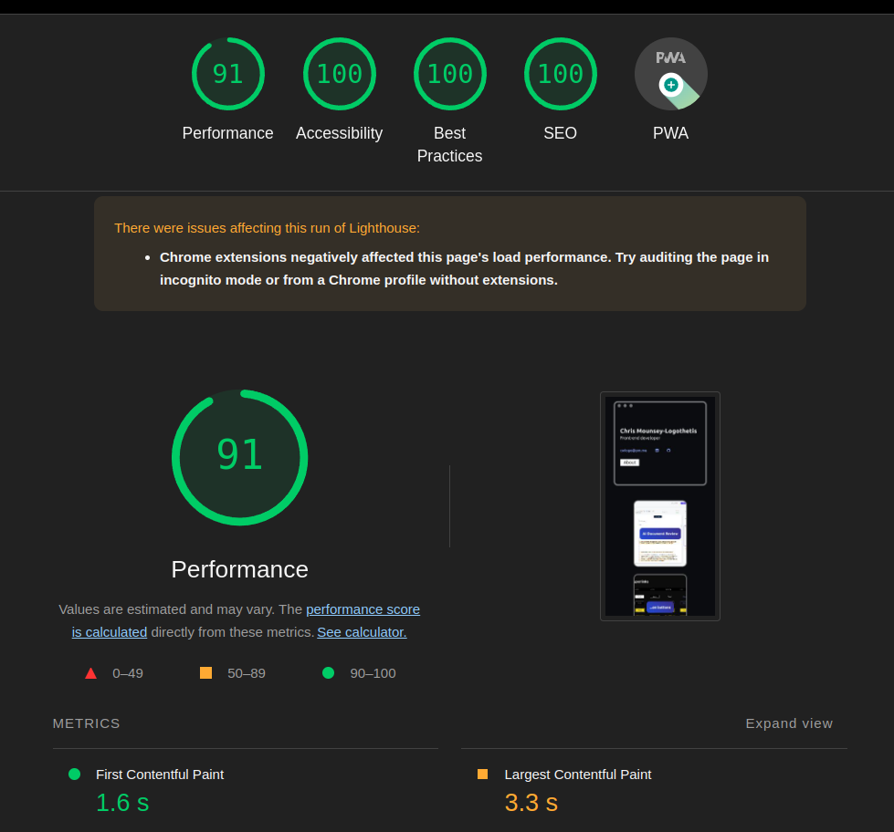
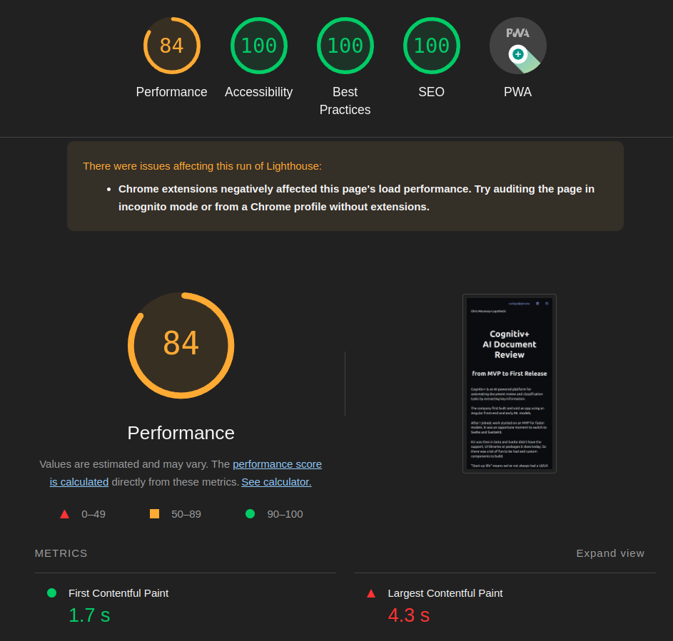
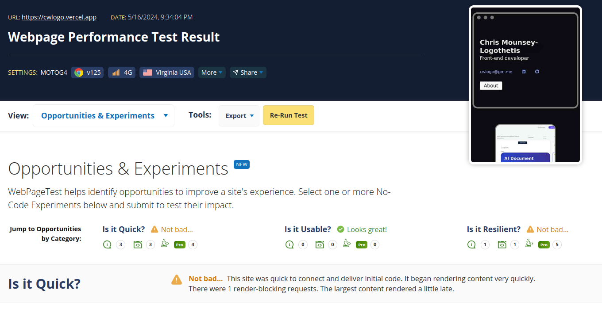
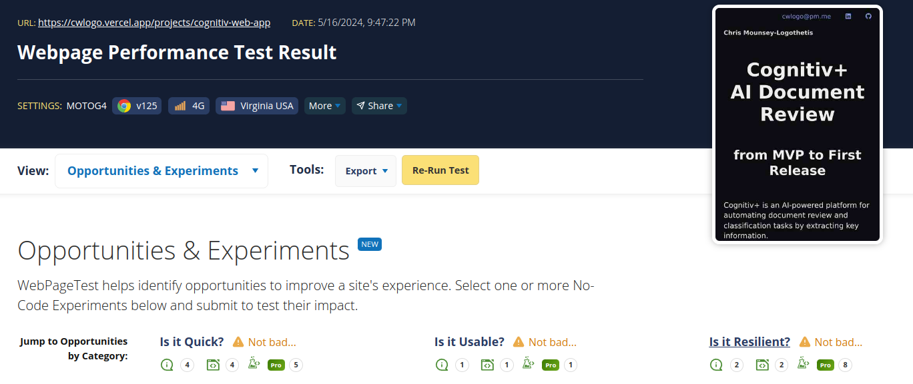
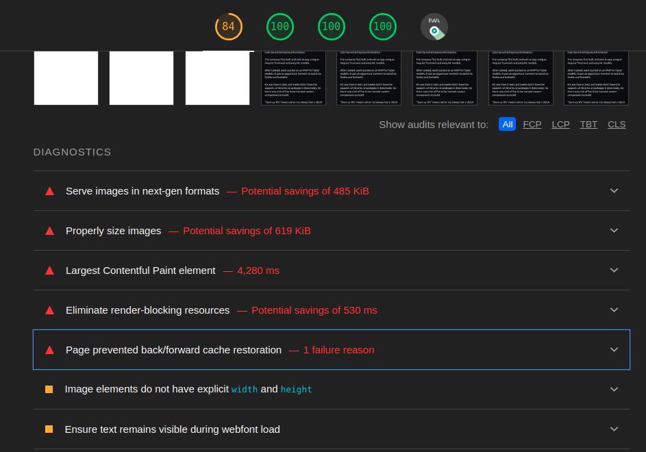

## Developing

Once you've created a project and installed dependencies with `npm install` (or `pnpm install` or `yarn`), start a development server:

```bash
npm run dev

# or start the server and open the app in a new browser tab
npm run dev -- --open
```

## Building

To create a production version of your app:

```bash
npm run build
```

You can preview the production build with `npm run preview`.

## Deployment

Current adapter in `svelte.config.js` is `auto`. 

App is deployed with Netlify.

Deploys with GitHub.

Settings here: https://app.netlify.com/sites/openai-arrays/overview

## Performance
initial Lighthouse scores for home page and projects/cognitiv-web-app 
  (this is Lighthouse lab test)




and from webpagetest.org on a 4G mobile in the US
- 
- 

This is largely due to the Largest Contentful Paint and images


With that in mind, I added four sorts of 'enhanced' image in my portfolio
1. where possible, I added SvelteKit's enhanced:img, which is similar to Next.js <Image/>. At build time, <enhanced:img> tags are replaced with a <picture> wrap, which provides multiple next-gen image types and sizes, and help with performance and layout shift (https://kit.svelte.dev/docs/images). These images are under the src directory in 'lib'. Took performance score up to 99.
2. Images in the blog are inside a string and I use the {@html} directive, but this is just raw HTML and so custom elements like <enhanced:img> won't work. So I use the traditional, long-winded approach:
```    
<picture>
      <source 
        sizes="(max-width: 1179px) 100vw, 1179px" 
        srcset="
            /blog_images/screenshot_active_squoosh_w_620.webp 620w,
            /blog_images/screenshot_active_squoosh_w_1179.webp 1179w"
        type="image/webp"
        />
      
    </picture>
``` 
This means uploading each original image to Squoosh or similar to reduce it, then use Cloudinary's responsive breakpoint tool to generate breakpoint sizes and duplicates at those sizes. I chose just to do this for webp, rather than avif as well, seeing as modern browsers all allow webp - https://caniuse.com/webp. The images are in `/static`, not `/lib`
3. <enhanced:img> won't work in Svelte's {#if / else} blocks, which I use at the top of the home page. So again, here, <picture> blocks are needed. And the images are in `/static`, not `/lib`
4. Finally, how to handle background images set in CSS with `background-image: url()` and where the url is dynamic? There are packages like Modernizr, but there's a simple, progressive image-set from CSS, which allows us to add a next gen image format like webp if the browser accepts it, then fallback to a png if not: 
```
  style="
         background-image: url({project.thumbnail_fallback});
         background-image: image-set(url({project.thumbnail_next_gen}));
        "
```