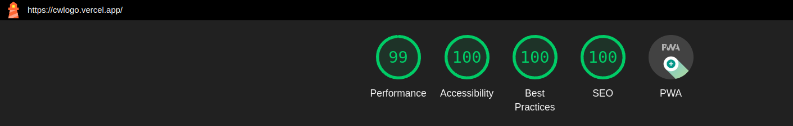
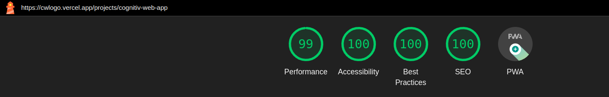
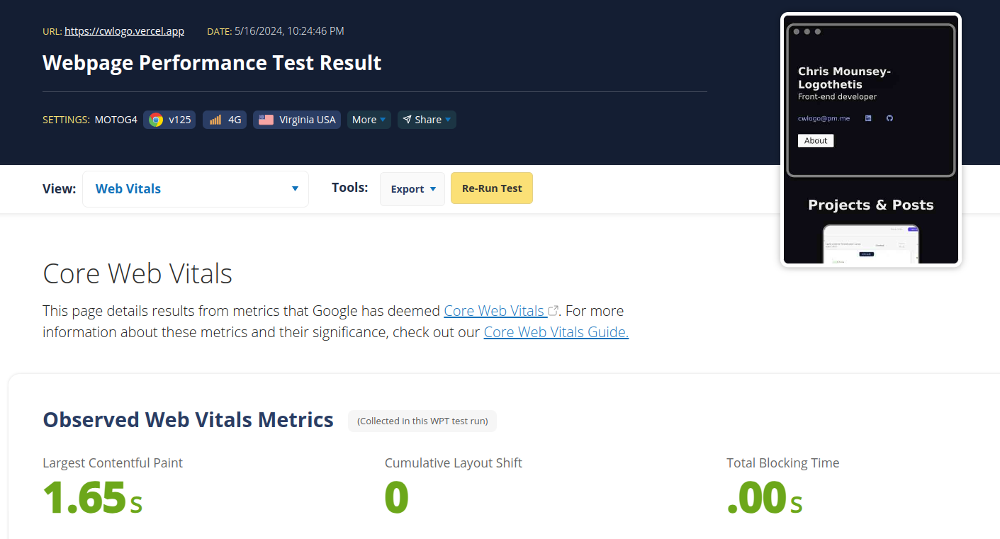

#My Portfolio
This project is built using SvelteKit, a modern framework with server-side rendering that delivers fast and performant web applications. Below you'll find information on the structure of the project, decisions I made along the way and how to run it.

## Table of Contents

- [Overview](#overview)
- [Technologies Used](#technologies-used)
- [CSS Methodology](#css-methodology)
- [Responsive Design](#responsive-design)
- [Image Optimization](#image-optimization)
- [Installation](#installation)
- [Usage](#usage)
- [Contributing](#contributing)
- [License](#license)

## Overview

This portfolio is a collection of my front-end development work, built using SvelteKit. It leverages SvelteKit's `page` and `page.server` files for routing and server-side logic.

## Technologies Used

- **Framework**: [SvelteKit](https://kit.svelte.dev/)
- **CSS Methodology**: LUCE (Layout, Utilities, Components, Exceptions)
- **Layouts**: Adapted from [every-layout.dev](https://every-layout.dev/) by Andy Bell and Hayden Pickering
- **Typography**: Responsive via [Utopia's fluid type generator](https://utopia.fyi/type/calculator/)
- **Image Optimization**: SvelteKit's `enhanced:img` and `<picture>` with `srcset` and `sizes`

## CSS Methodology

The CSS in this project is written using my adaptation of Andy Bell's CUBE methodology, which I have renamed as LUCE:

- **L**ayout: Defines the overall structure and grid of the page.
- **U**tilities: Contains utility classes for common styling needs.
- **C**omponents: Encapsulates styles for individual components.
- **E**xceptions: Handles edge cases and overrides.

The Cube docs are the best place to learn about it: https://cube.fyi/. It might remind you of BEM, but in short, it looks like this:

`<div class="l: stack | u: text-step--1 w-500 | c: button link | e: contact">`

It makes it really easy to find relevant CSS across a project. There's an SCSS folder with sub-folders for Layout, Utilities and Components, which are re-used. Should an element need specific styles that won't be re-used elsewhere, then they are written in the `<style>` block in the Svelte page. This way, any developer can look at the CSS classes on an element and immediately know what roles they have and where styles might need changing.

## Responsive Design

Layouts are adapted from [every-layout.dev](https://every-layout.dev/) and make extensive use of modern browser algorithms for responsiveness, minimizing the need for media queries. Typography is made responsive using [Utopia's fluid type generator](https://utopia.fyi/type/calculator/).

## Image Optimization

Images are served in next-gen formats using SvelteKit's `enhanced:img` where possible. For other parts, the `<picture>` element with `srcset` and `sizes` attributes is used to ensure optimal image loading and performance. A few words are required for the handling of images and the project structure.

### Performance
initial Lighthouse scores for performance for the home page and projects/cognitiv-web-app weren't bad:

- Home page: 91
- projects/cognitiv-web-app: 84

Lighthouse is a lab test. Using webpagetest.org on a 4G mobile in the US the home and project page were scored as "Not bad" - Largest Contenful Pain was 3 seconds

Analysing lighthouse and webpagetest scores brought a bunch of small savings from render-blocking resources lik font-awesome, but the major factor was the uncompressed png images.

With that in mind, I added four sorts of 'enhanced' image in my portfolio
1. Where possible, I added SvelteKit's enhanced:img, which is similar to `<Image/>` in Next.js. At build time, `<enhanced:img>` tags are replaced with a `<picture>` wrap, which provides multiple next-gen image types and sizes, and help with performance and layout shift (https://kit.svelte.dev/docs/images). These images are under `src/lib` and not SvelteKit's `static` directory. (Note: in a SvelteKit project, the static folder is meant for assets that should be served directly to the client without processing by Vite. This means that files in the static folder are not accessible through module imports like other files in the src directory.)
2. Images in the blog are inside a string and I use the {@html} directive, but this is just raw HTML and so custom elements like <enhanced:img> won't work. So I use the traditional, long-winded approach:
```    
<picture>
      <source 
        sizes="(max-width: 1179px) 100vw, 1179px" 
        srcset="
            /blog_images/screenshot_active_squoosh_w_620.webp 620w,
            /blog_images/screenshot_active_squoosh_w_1179.webp 1179w"
        type="image/webp"
        />
      
    </picture>
``` 
This means uploading each original image to Squoosh or similar to reduce it, then use Cloudinary's responsive breakpoint tool to generate breakpoint sizes and duplicates at those sizes. I chose just to do this for webp, rather than avif as well, seeing as modern browsers all allow webp - https://caniuse.com/webp. The images are in `/static`, not `/lib`
3. <enhanced:img> won't work in Svelte's {#if / else} blocks, which I use at the top of the home page. So again, here, <picture> blocks are needed. And the images are in `/static`, not `/lib`
4. Finally, how to handle background images set in CSS with `background-image: url()` and where the url is dynamic? There are packages like Modernizr, but there's a simple, progressive image-set from CSS, which allows us to add a next gen image format like webp if the browser accepts it, then fallback to a png if not:
```
  style="
         background-image: url({project.thumbnail_fallback});
         background-image: image-set(url({project.thumbnail_next_gen}));
        "
```

#### After
Using enhanced images dramatically improves performance.


Largest contentful paint for the home page and product page with webpagetest.com are now under 2seconds on a 4G mobile in the US.


### Thoughts on images
There's quite a lot of phaff in serving images in different ways, especially when manually creating reponsive duplicates. This could be solved by Cloudinary. And borrowing from the SvelteKit docs for enhanced:img:
```
Consider serving all images via CDN regardless of the image optimization types you use. CDNs reduce latency by distributing copies of static assets globally.
```

## Installation

To run this project locally, follow these steps:

1. Clone the repository:
    ```sh
    git clone https://github.com/your-username/your-repo-name.git
    ```

2. Navigate to the project directory:
    ```sh
    cd your-repo-name
    ```

3. Install the dependencies:
    ```sh
    npm install
    ```

## Usage

To start the development server:

```sh
npm run dev
```

To build the project for production:

```sh
npm run build
```

To preview the production build:

```sh
npm run preview
```

## Deployment

This project is deployed using [Vercel](https://vercel.com/). Vercel provides a seamless integration with GitHub, enabling continuous deployment. Every push to the `main` branch automatically triggers a deployment.

To deploy your own version:

1. Fork the repository and clone it to your local machine.
2. Make your changes and push them to your GitHub repository.
3. Sign in to [Vercel](https://vercel.com/) and import your GitHub repository.
4. Follow the prompts to set up your project.
5. Vercel will automatically deploy your project and provide you with a live URL.

## Contributing

Contributions are welcome! Please open an issue or submit a pull request for any improvements or bug fixes.

## License

This project is licensed under the MIT License. See the [LICENSE](LICENSE) file for details.


